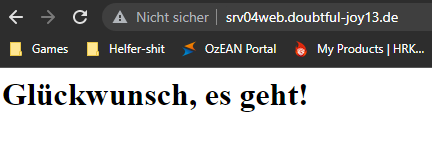
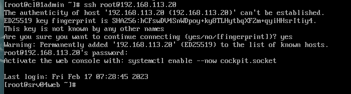

# Dokumentation Heimnetz

## Aufgaben

+ [x] Netze rot, grün, orange entsprechen eigenen Vorgaben
  + [x] IP
  + [x] Verbindung Host
  + [x] Verfügbarkeit der Dienste
+ [x] IPFire, Server und Adminrechner folgen eigenen Vorgaben
+ [x] IPFire aufgesetzt, Ping möglich
+ [x] DNS von IPFire funktioniert entsprechend Vorgabe
+ [x] DNS Server im Intranet aufgesetzt und konfiguriert
+ [x] DNS löst bei Test auf Adminrechner lokale und globale Namen auf
+ [x] Interner DHCP Server im Intranet aufgesetzt und konfiguriert
+ [x] Web-Server aufgesetzt und konfiguriert
+ [x] Webserver mit Firefox des Hosts aufrufbar mittels IP (http)
---
**Zusatz**
+ [x] Zugriff auf Webserver über Hostname statt IP ist möglich
+ [x] Zugriff auf Webserver über Hostname und SSL/TLS verschlüsselt (https)
+ [ ] Proxyeinstellung auf IPFire erlauben https Zugriffe von IPFire ins Internet
+ [ ] Kommunikation srv04web mit srv03db

## Virtualisierungsumgebung
+ Hyper-V
+ Erstellung von 3 Switches
  + extern = VMnet8 (mit Zugang zum WLAN-Adapter)
  + intern1 = VMnet1
  + intern2 = VMnet2

## Installationen

### IP-Fire
+ Hostname: srv01ipfire
+ Hinzufügen der drei Switche
+ "sicherer Start" deaktivieren
+ Installation wie gewohnt
  + Hinzufügen der MAC-Adressen der Switche 
    + VMnet8 - 00:15:5D:B2:14:07
    + VMnet1 - 00:15:5D:B2:14:09
    + VMnet2 - 00:15:5D:B2:14:08
  + Vergabe IP-Adressen
    + VMnet8 = 192.168.178.3
    + VMnet1 = 192.168.13.3
    + VMnet2 = 192.168.113.3
+ DNS -> 192.168.72.2

### DNS + DHCP
+ Hostname: srv02dc
+ Hinzufügen Switch intern 1 für VMnet1
+ "sicherer Start" deaktivieren
+ Betriebssystem: CentOS 9
+ Konfiguration static IP-Adresse:

```
nmcli device
nmcli connection modify eth0 ipv4.addresses 192.168.13.20/24
nmcli connection modify eth0 ipv4.gateway 192.168.13.3
nmcli connection modify eth0 ipv4.dns "8.8.8.8 8.8.4.4"
nmcli connection modify eth0 ipv4.method manual
```

+ Installation `dnsmasq`

```
yum -y install dnsmasq
systemctl start dnsmasq
systemctl enable dnsmasq
systemctl status dnsmasq
```


### Bearbeitung der /etc/dnsmasq.conf
```
        cp /etc/dnsmasq.conf /etc/dnsmasq.conf.orig
        nano /etc/dnsmasq.conf

listen-address=127.0.0.1,192.168.13.20
interface=eth0
expand-hosts (soll Clients in die /etc/hosts aufnehmen)
domain=Doubtful-Joy13.de
server=192.168.72.2
server=8.8.8.8
server=8.8.4.4
address=/Doubtful-Joy13.de/127.0.0.1
address=/Doubtful-Joy13.de/192.168.13.20

        dnsmasq -test
        nano /etc/resolv.con

nameserver 127.0.0.1
```
+ die `resolv.conf` wird vom lokalen deamon verwaltet (u. a. NetworkManager), welcher Änderungen überschreibt
+ daher wird sie schreibgeschützt

```
chattr + i /etc/resolv.conf
lsattr /etc/resolv.conf
```
+ die `/etc/hosts` bearbeiten, um dnsmasq-controller und gateway einzutragen

```
nano /etc/hosts
        127.0.0.1		dnsmasq
        192.168.13.20	dnsmasq
        192.168.13.3	gateway
```
+ Testen der lokalen Domäne `Doubtful-Joy13.de`


``Bemerkung: ipfire wurde umbenannt von "gateway" in "srv01ipfire"``

### Einrichtung DHCP
+ Bearbeitung der `/etc/dnsmasq.conf`

```
dhcp-range=192.168.13.50,192.168.13.150,12h
dhcp-leasefile=/var/lib/dnsmasq/dnsmasq.leases
dhcp-option=3,192.168.13.3
dhcp-option=option:dns-server,192.168.13.20
dhcp-option=option:netmask,255.255.255.0
#dhcp-authoritative
```

## Installation Administrator-Rechner
+ Hostname: cl01admin
+ Hinzufügen Switch intern 1 für VMnet1
+ "sicherer Start" deaktivieren
+ Betriebssystem: CentOS 9 -> diesmal als Client-Rechner
+ gewohnte Installation
+ LAN-Einstellungen > IPv4-Methode > Automatisch DHCP
  + Rechner erhält nun über aufgesetzten DHCP-Server seine IP-Adresse, die Subnetzmaske und das Gateway


## Installation Datenbank-Server
+ Hostname: srv03db
+ Hinzufügen Switch intern 1 für VMnet1
+ "sicherer Start" deaktivieren
+ Betriebssystem: CentOS 9 -> Server
+ gewohnte Installation
+ da der Server die Daten vom Webserver erhalten soll, benötigt er eine statische IP vom DHCP

```
srv02dc$ nano /etc/dnsmasq.conf
dhcp-host=00:15:5d:b2:14:0e,srv03db,192.168.13.22
```


+ Auflösung von DNS-Anfragen funktionieren -> geprüft mit `ping google.de`


### Installation MariaDB

```
yum install mariadb-server
systemctl enable mariadb
systemctl start mariadb
mysql_secure_installation
  Enter
  Yes
  No
  Yes
  Yes
  Yes
  Yes
mysql -u root -p
  CREATE DATABASE tickets;
  CREATE user dbadmin;
  GRANT ALL ON tickets.* TO dbadmin@localhost IDENTIFIED BY '12345';
  exit;
```

## Installation Webserver
+ Hostname: srv04web
+ Hinzufügen Switch intern2 für VMnet2
+ "sicherer Start" deaktivieren

### Installation http (apache)

``` 
yum install httpd
systemctl start httpd
systemctl enable httpd
firewall-cmd --permanent --zone=public --add-port=80/tcp
firewall-cmd --permanent --zone=public --add-port=443/tcp
```

**Zusatz: SSL/TLS-Verschlüsselung**

yum install mod_ssl

**Zusatz: Aufruf über Hostname**

```
Setting up A Record for srv04web
$ nano /etc/dnsmasq.conf
  host-record=srv04web.doubtful-joy13.de,192.168.113.20
```



### Überprüfung der Verbindungen // Firewall-Regeln
+ ping an srv01ipfire von allen Maschinen möglich
+ ping zwischen den Maschinen im Grünen Netz möglich
+ ping von srv04web ins Grüne Netz nicht möglich -> muss auch nicht möglich sein
+ ping aus dem Grünen Netz zu srv04web -> funktioniert
+ Zugriff auf srv04web über ssh vom cl01admin-Rechner aus -> funktioniert



## Proxy einrichten

- [x] srv01ipfire
- [x] srv02dc
- [x] srv03db
- [x] cl01admin


## unbound.conf
+ srv01ipfire -> `/etc/unbound/unbound.conf`

  ```
    # Insecure Domains 
    domain-insecure: bsz-et.lan.dd-schulen.de
    	
	# Local Zones
	unblock-lan-zones: yes
	insecure-lan-zones: yes

	# Hardening Options
	harden-dnssec-stripped: no
	harden-large-queries: yes
	harden-referral-path: yes
	aggressive-nsec: yes

  ```
## Anmerkungen
+ Switch extern muss von WLAN-Adapter auf Ethernet umgestellt werden
+ IP-Adresse des VMnet8 auf dem IPFire ändern
+ dnsmasq.service failed, wenn der Server heruntergefahren wurde; muss beim Starten der VMs neu gestartet werden `systemctl restart dnsmasq.service`
+ Switch intern1 und intern2 müssen vom host getrennt werden
  + anschließend muss Portforwarding betrieben werden
  + vom host über 192.168.72.3:80 muss auf den Webserver weiterleiten -> IPFire portforwarding port 80 auf Webserver
