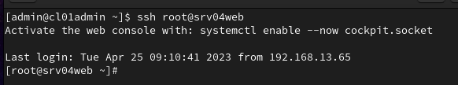

# Dokumentation Heimnetz

## Aufgaben Durchführen Teil 1

+ [x] Netze rot, grün, orange entsprechen eigenen Vorgaben
  + [x] IP
  + [x] Verbindung Host
  + [x] Verfügbarkeit der Dienste
+ [x] IPFire, Server und Adminrechner folgen eigenen Vorgaben
+ [x] IPFire aufgesetzt, Ping möglich
+ [x] DNS von IPFire funktioniert entsprechend Vorgabe
+ [x] DNS Server im Intranet aufgesetzt und konfiguriert
+ [x] DNS löst bei Test auf Adminrechner lokale und globale Namen auf
+ [x] Interner DHCP Server im Intranet aufgesetzt und konfiguriert
+ [x] Web-Server aufgesetzt und konfiguriert
+ [x] Webserver mit Firefox des Hosts aufrufbar mittels IP (http)
---
**Zusatz**
+ [x] Zugriff auf Webserver über Hostname statt IP ist möglich
+ [x] Zugriff auf Webserver über Hostname und SSL/TLS verschlüsselt (https)
+ [x] Proxyeinstellung auf IPFire erlauben https Zugriffe von IPFire ins Internet
+ [x] Kommunikation srv04web mit srv03db


## IP-Fire
+ Hostname: srv01ipfire
+ Hinzufügen der drei Switche
+ Installation wie gewohnt
  + Hinzufügen der MAC-Adressen der Switche 
    + VMnet8 - 00:15:5D:B2:14:07
    + VMnet1 - 00:15:5D:B2:14:09
    + VMnet2 - 00:15:5D:B2:14:08
  + Vergabe IP-Adressen
    + VMnet8 = 192.168.72.3
    + VMnet1 = 192.168.13.3
    + VMnet2 = 192.168.113.3
+ DNS -> 192.168.72.2

### Proxy-Einstellungen

```
$ nano /etc/profile

export http_proxy=http://10.254.5.100:3128
export https_proxy=http://10.254.5.100:3128
export no_proxy=localhost,srv04web.doubtful-joy13.de,192.168.113.20

```


### unbound.conf
+ srv01ipfire -> `/etc/unbound/unbound.conf`

  ```
    # Insecure Domains 
    domain-insecure: bsz-et.lan.dd-schulen.de
    	
	# Local Zones
	unblock-lan-zones: yes
	insecure-lan-zones: yes

	# Hardening Options
	harden-dnssec-stripped: no
	harden-large-queries: yes
	harden-referral-path: yes
	aggressive-nsec: yes

  ```

### Firewall-Regeln


**Begründung**
+ Port 80 für unsicherern Webzugriff
+ Port 443 für Webzugriff über TLS
+ Port 3306 für Zugriff auf die Datenbank aus der DMZ

## DNS + DHCP
+ Hostname: srv02dc
+ Hinzufügen Switch intern 1 für VMnet1
+ Betriebssystem: CentOS 9
+ Konfiguration statische IP-Adresse:

```
nmcli device
nmcli connection modify eth0 ipv4.addresses 192.168.13.20/24
nmcli connection modify eth0 ipv4.gateway 192.168.13.3
nmcli connection modify eth0 ipv4.dns "8.8.8.8 8.8.4.4"
nmcli connection modify eth0 ipv4.method manual

```

+ Installation `dnsmasq`

```
yum -y install dnsmasq
systemctl start dnsmasq
systemctl enable dnsmasq
systemctl status dnsmasq

```


### Bearbeitung der /etc/dnsmasq.conf
```
$ cp /etc/dnsmasq.conf /etc/dnsmasq.conf.orig
$ nano /etc/dnsmasq.conf

listen-address=127.0.0.1,192.168.13.20
interface=eth0
expand-hosts
domain=Doubtful-Joy13.de
server=192.168.72.2
server=8.8.8.8
server=8.8.4.4
address=/Doubtful-Joy13.de/127.0.0.1
address=/Doubtful-Joy13.de/192.168.13.20

$ dnsmasq -test
$ nano /etc/resolv.conf

nameserver 127.0.0.1

```
+ die `resolv.conf` wird vom lokalen deamon verwaltet (u. a. NetworkManager), welcher Änderungen überschreibt
+ daher wird sie schreibgeschützt

```
chattr +i /etc/resolv.conf
lsattr /etc/resolv.conf

```
+ die `/etc/hosts` bearbeiten, um dnsmasq-controller, gateway, Webserver und Datenbankserver einzutragen

```
nano /etc/hosts
        127.0.0.1	srv02dc.doubtful-joy13.de srv02dc
        192.168.13.20	srv02dc.doubtful-joy13.de srv02dc
        192.168.13.3	srv01ipfire.doubtful-joy13.de srv01ipfire
        192.168.113.20  srv04web.doubtful-joy13.de srv04web
        192.168.13.22   srv03db.doubtful-joy13.de  srv03db
```
+ Testen der lokalen Domäne `Doubtful-Joy13.de`


``Bemerkung: ipfire wurde umbenannt von "gateway" in "srv01ipfire"``

### Firewall-Regeln

```
firewall-cmd --add-service=dns --permanent
firewall-cmd --add-service=dhcp --permanent
firewall-cmd --reload
```

**Zusatz: Aufruf Webserver über Hostname**

```
# Setting up A Record for srv04web

$ nano /etc/dnsmasq.conf
  host-record=srv04web.doubtful-joy13.de,192.168.113.20

# Adding in C:\Windows\System32\Drivers\etc\hosts


```

### Einrichtung DHCP
+ Bearbeitung der `/etc/dnsmasq.conf`

```
dhcp-range=192.168.13.50,192.168.13.150,12h
dhcp-leasefile=/var/lib/dnsmasq/dnsmasq.leases
dhcp-option=3,192.168.13.3
dhcp-option=option:dns-server,192.168.13.20
dhcp-option=option:netmask,255.255.255.0

```

## Installation Administrator-Rechner
+ Hostname: cl01admin
+ Hinzufügen Switch intern 1 für VMnet1
+ Betriebssystem: CentOS 9 -> diesmal als Client-Rechner
+ gewohnte Installation
+ LAN-Einstellungen > IPv4-Methode > Automatisch DHCP
  + Rechner erhält nun über aufgesetzten DHCP-Server seine IP-Adresse, die Subnetzmaske und das Gateway


## Installation Datenbank-Server
+ Hostname: srv03db
+ Hinzufügen Switch intern 1 für VMnet1
+ Betriebssystem: CentOS 9 -> Server
+ gewohnte Installation
+ da der Server die Daten vom Webserver erhalten soll, benötigt er eine statische IP vom DHCP

```
srv02dc$ nano /etc/dnsmasq.conf
dhcp-host=00:15:5d:b2:14:0e,srv03db,192.168.13.22
```


+ Auflösung von DNS-Anfragen funktionieren -> geprüft mit `ping google.de`


### Installation MariaDB

```
yum install mariadb-server
systemctl enable mariadb
systemctl start mariadb
mysql_secure_installation
  Enter
  Yes
  No
  Yes
  Yes
  Yes
  Yes
mysql -u root -p
  CREATE DATABASE tickets;
  CREATE user admin;
  GRANT ALL ON tickets.* TO admin@srv04web IDENTIFIED BY '12345';
  exit;
```

### Firewall-Richtlinien

```
$ firewall-cmd --zone=public --add-port=3306/tcp
$ firewall-cmd --runtime-to-permanent
```

### Konfiguration SELinux für Datenbankzugriff

```
$ setsebool -P httpd_can_network_connect_db on

```

## Installation Webserver
+ Hostname: srv04web
+ Hinzufügen Switch intern2 für VMnet2

### Installation http (apache)

``` 
yum install httpd
systemctl start httpd
systemctl enable httpd
firewall-cmd --permanent --zone=public --add-port=80/tcp
firewall-cmd --permanent --zone=public --add-port=443/tcp
```

### Installation php8.1

```
$ dnf install https://dl.fedoraproject.org/pub/epel/epel-release-latest-9.noarch.rpm

$ dnf install https://rpms.remirepo.net/enterprise/remi-release-9.rpm

$ dnf module install php:remi-8.1

$ php -v

```


**Zusatz: SSL/TLS-Verschlüsselung**

```
yum install mod_ssl
```

## Proxy auf allen Servern (außer IPFire) einrichten

- [x] srv02dc
- [x] srv03db
- [x] cl01admin
- [x] srv04web

```
$ nano /etc/environment

export http_proxy=http://10.254.5.100:3128
export https_proxy=http://10.254.5.100:3128
export no_proxy=localhost,srv04web.doubtful-joy13.de,192.168.113.20

```

### Überprüfung der Verbindungen // Firewall-Regeln
+ ping an srv01ipfire von allen Maschinen möglich
+ ping zwischen den Maschinen im Grünen Netz möglich
+ ping von srv04web ins Grüne Netz nicht möglich -> muss auch nicht möglich sein
+ ping aus dem Grünen Netz zu srv04web -> funktioniert


# Durchführen Teil 2

+ [] Ablaufdoku mit aktuellem Netzwerkplan als PDF im Ordner abgelegt
+ [x] Datenbankserver im richtigen Netz aufgesetzt und updatebar
+ [x] Administrativer Zugriff auf DB-Server und Web-Server vom Adminrechner aus möglich
  + [x] Administrativer Zugriff über SSH-Key (root) möglich

```
# Erstellung key-pair auf cl01admin

$ ssh-keygen
/home/admin/.ssh/id_rsa

# Übertragung des public key auf srv03db srv04web

$ ssh-copy-id root@srv03db

$ ssh-copy-id root@srv04web

```





+ [x] PHP oder vergleichbar installiert


+ [x] Datenbank und Datenbankadmin angelegt, lokaler Zugriff möglich


+ [x] Datensatz, der auf Web-Server erfasst wird erscheint im DB Server (Nachweis mit SQL Befehl auf dem DB Server)

```
mysql -u root -p
show databases;
use tickets;
select * from ticketwand_ticket

```

+ [x] Kommunikation DMZ -> Intranet ist in IPFire auf das Notwendige beschränkt 
  + nur Kommunikation/Port für Datenbank ist geöffnet (3306)


# Deploy Django

```
dnf install mod_wsgi httpd
systemctl restart httpd.service

# env

python3 -m venv .env
source .env/bin/activate
pip install -r lf9-feuerwand/env.conf


# /etc/httpd/conf.d/python-wsgi.conf

```


```

# settings.py

ALLOWED_HOSTS = ["192.168.72.3"]

DATABASES = {
  'default': {
    'ENGINE': 'django.db.backends.mysql',
    'NAME': 'tickets',
    'USER': 'admin',
    'PASSWORD': '12345',
    'HOST': '192.168.13.22',
    'PORT': '3306',
  }
}

```


# Auswertung und Reflexion

+ [x] Wesentliche Schritte der Installation und Konfiguration der Services für DNS/DHCP, Webserver/Programmiersprache/DB sind in der Ablaufdoku beschrieben.
+ [x] Geänderte und ergänzte Eintragungen in den Config-Files sind angegeben und kommentiert.
+ [x] Firewalleinstellungen von IPFire sind in der Ablaufdoku beschrieben und begründet.
+ [ ] Aktueller Netzwerkplan dokumentiert den finalen Aufbau
+ [ ] Soll-Ist-Vergleich: Ergebnis und Zeitaufwand
+ [ ] Benennung von Defiziten zur Sicherheit der Lösung - Optimierungsvorschläge
